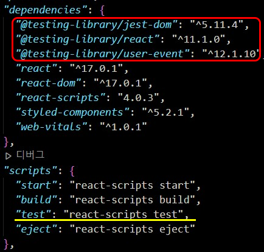
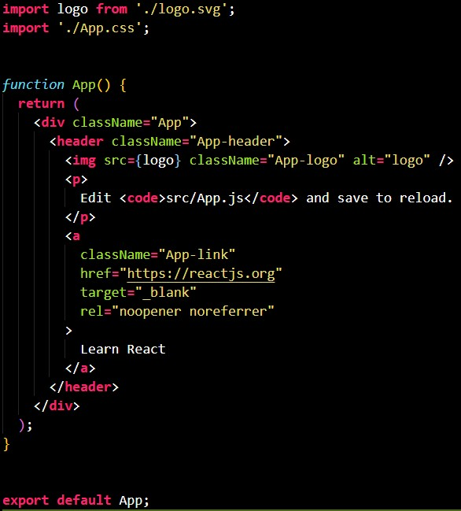
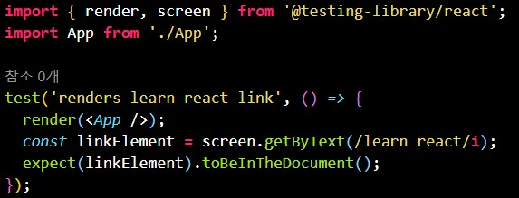
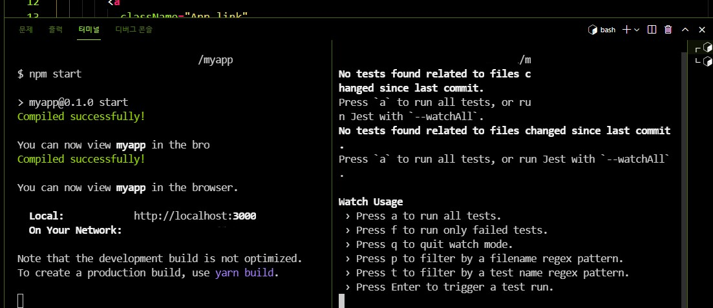
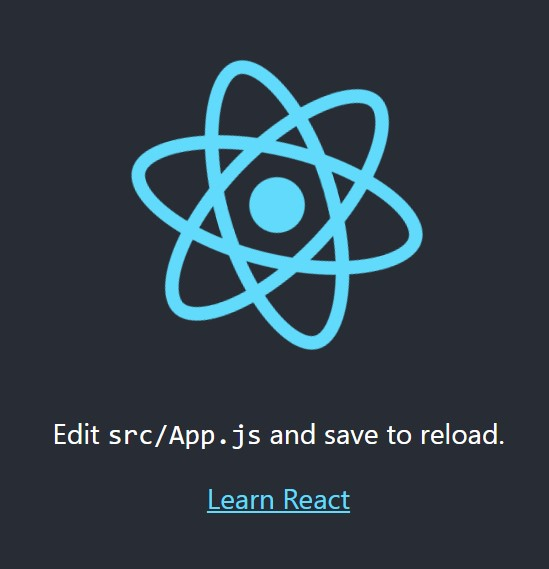
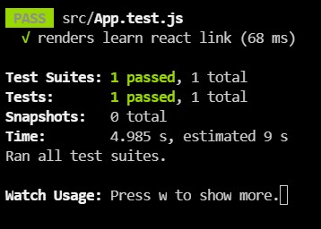
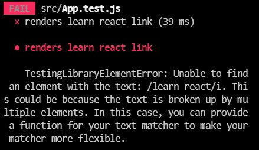
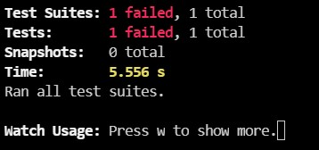
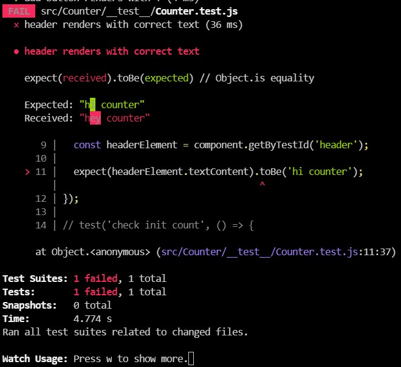

# 🐐🐙TDD(테스트 주도 개발)
## React-testing-library를 기반으로 TDD개발.
<br/>

# Enzyme과 RTL(React-testing-library)비교
- **`Enzyme`**
  - RTL등장 이전까지 Enzyme이라는 testing-library가 많이 사용되고 있었다. 
  - `Implementation Driven Test`방법론을 따르는 테스트를 작성하기에 적합하다.
  - 실제 브라우저 DOM이 아닌, 가상 DOM을 기준으로 테스트를 작성해야한다. 
  - 따라서, 테스트 대상 React 컴포넌트의 props나 state를 조회하여 검증하기 용이하다.

- **`react-testing-library`**
  - `Behavior Driven Test`방법론을 따르는 테스트를 작성하기에 적합하다.
  - jest를 기반으로 UI테스트를 지원해주는 DOM Testing Library에 React Component를 위한 API들이 추가된 것이다.
  - 실제 DOM을 기준으로 테스트를 작성하기 때문에 어떤 React컴포넌트를 사용하는지는 의미가 없으며, 사용자 브라우저에서 랜더링하는 실제 HTML마크업의 모습이 어떤지에 대해서 테스트하기 용이하다.
  - `render()`함수로 컴포넌트를 랜더링해주고,`getBy*`등의 query를 통해서 요소를 찾고(getBy*, queryBy*, findBy* 등 다양하게 존재함.), 이벤트를 발생(`fireEvent`)시키고, `expect` function을 통해서 예측한 결과대로 이루어지는지 확인한다.
  - 컴포넌트의 기능이 똑같이 작동한다면 컴포넌트의 내부구현방식이 많이 바뀌었어도 테스트가 실패하지 않도록 설계되었다.
  - react-testing-library는 정말 필요한 기능들만 지원을 해주기 때문에 매우 가볍고, 개발자들도 일관성있고 좋은 관습을 따르는 테스트 코드를 작성할 수 있도록 유도해준다.

*테스트 페러다임 자체가 `Behavior Dirven Test` 쪽으로 흘러가는 추세여서 Enzyme보다 RTL 사용 확률이 높다.*


# cra(create-react-app)으로 생성된 프로젝트는 기본적으로 jest가 내장되어 있다.
- 아래 사진에서 볼 수 있듯이 testing-library가 이미 설치되어 있다.(빨간블록)
- npm run start를 해서 test.js파일을 실행시키자.(노란밑줄)
  - 

<br/>
<br/>
<br/>

---
## * cra로 앱 생성 후 어떠한 수정없이 npm start와 npm run test를 실행한 코드이다. (정적 컴포넌트 테스팅)
  - src > app.js 
    - 
  - src > app.test.js
    - 
  - 터미널창에서 왼:npm start(yarn start)와 오:npm run test
    - 
    - Jest는 기본적으로 수정된 파일과 연관되어 있는 test만 실행하는 것 같다. 지금은 아무런 수정사항없이 test를 실행했기때문에 위의 오른쪽과 같은 메세지가 출력된다.
    - 프로젝트에 기본적으로 작성되어 있는 `App.test.js`파일을 실행시키기 위해서 **a 키 를 눌러서** 모든 테스트를 실행시키거나, `__test__`폴더를 만들어서 그 안의 **x.test.js파일을 실행**시킬 수 있다.
  - npm start(yarn start)한 후 화면에 렌더링.(localhost:3000)
    - 
  - npm run test후 성공 터미널.
    - 1개의 테스트가 성공되었음을 보여준다.
      - 
    - 위의 이미지를 조금 더 **설명**해보자면, App Component를 render하고 `getByText`로 'learn react'라는 텍스트를 가지고 있는 DOM Element를 찾은 후에, 해당 요소가 document에 존재하는지를 테스트한 것이다.
  - npm run test후 실패 터미널.
    - App.jsx파일로 가서 'Learn React'텍스트가 있는 a태그의 내용을 'react!!'로 **수정**했다.
      - 
      - 
    - 테스트가 실패했음을 보여준다.

</br>

- 기본적인 TDD 동작을 살펴 보았으니 가벼운 카운터앱을 만들어보자.

<br/>

---
## * 동적 컴포넌트 테스팅
  -  src디렉터리에서 *App.test.js*파일을 *삭제* 후, **`Counter`폴더** 생성하고, 하위 폴더에 `Counter.jsx`파일과 **`__test__`폴더** 생성. `__test__`의 하위 폴더에 `Counter.test.js`파일 생성.

  1. 컴포넌트 로직이 작성될 Counter.jsx파일과 테스트를 위한 Counter.test.js파일을 생성하고 테스트가 잘 동작하는지 확인한다.
      ```js
      // directory경로 src > Counter > Counter.jsx
      import React from 'react';

      function Counter() {
        return (
          <div>
            <h3 data-testid="header">hi counter</h3>
          </div>
        );
      }

      export default Counter;
      ```
      - `header`라는 testId를 가진 태그 안의 text가 일치하는지 확인하는 테스트를 작성했다. (h3태그의 data-testid 어트리뷰트가 header이므로 그 안에 작성된 텍스트 hi counter가 일치하는지 테스트코드를 작성함.)
      - `expect(headerElement.textContent).toBe('hi counter');` === 'headerElement.textContent에 'hi counter'가 있을것으로(toBe) 기대한다(expect). 는 뜻으로 이해하면 쉽다.
        ```js
        // src > Counter > __test__ > Counter.test.js
        import React from 'react';
        import Counter from '../Counter';
        import { render } from '@testing-library/react';
        import '@testing-library/jest-dom/extend-expect';

        test('header renders with correct text', () => {
          const component = render(<Counter />);
          // const {getByTestId} = render(<Counter />); // 동일
          const headerElement = component.getByTestId('header');

          expect(headerElement.textContent).toBe('hi counter');
        });
        ```
      - 만약 Counter.jsx에서 **'hi counter'** 를 **'hey counter'** 로 바꾸면 어떻게 될까?
        - 
        - `hi counter를 기대`했는데 `실제로 가져온 건 hey counter`라 **테스트 실패**를 보여준다.
        - 친절하게도 경로와 코드가 작성된 줄도 알려준다.
    
</br>

2. 초기카운트인 '0'과, '-'버튼, '+'버튼이 일치하는지 테스트.
    - 초기값`0`, 카운트 조작`-`, `+`버튼들을 컴포넌트 로직과 일치하는 테스트 코드를 작성.
      ```js
      // Counter.test.js
      import React from 'react';
      import Counter from '../Counter';
      import { render } from '@testing-library/react';
      import '@testing-library/jest-dom/extend-expect';

      test('header renders with correct text', () => {
        const component = render(<Counter />);
        // const {getByTestId} = render(<Counter />); // 동일
        const headerElement = component.getByTestId('header');

        expect(headerElement.textContent).toBe('hi counter');
      });

      // <!-- 새로 추가됨 -->
      test('check init count', () => {
        const { getByTestId } = render(<Counter />);
        // '0'이 있는지
        const countElement = getByTestId('counter');
        expect(countElement.textContent).toBe('0');
      });

      test('add button renders with +', () => {
        const { getByTestId } = render(<Counter />);
        const addBtn = getByTestId('plusButton');
        // '+' 가 있는지
        expect(addBtn.textContent).toBe('+');
      });

      test('subtract button renders with -', () => {
        const { getByTestId } = render(<Counter />);
        const minusBtn = getByTestId('minusButton');
        // '-' 가 있는지
        expect(minusBtn.textContent).toBe('-');
      });
      // <!-- 여기까지 -->
      ```
    - 여기까지 작성하게 되면, Counter.jsx에서는 아직 'hi counter'라는 제목만 붙여 주었기 때문에 테스트에서 실패가 된다.
    - 그럼 이제 실패한 테스트를 성공하도록 Counter.jsx를 수정해서 count초기 숫자0과 +, -버튼을 만들어서 렌더해주자.
      ```js
      // Counter.jsx
      import React from 'react';

      function Counter() {
        return (
          <div>
            <h3 data-testid="header">hey counter</h3>
            <!-- 새로 추가됨 -->
            <div className="center">
              <button data-testid="minusButton">-</button>
              <p data-testid="counter">0</p>
              <button data-testid="plusButton">+</button>
            </div>
            <!-- 여기까지 -->
          </div>
        );
      }

      export default Counter;
      ```
    - 짜잔! 테스트가 pass되는걸 확인할 수 있다.

3. plus, minus 구현
    - 초기값 0 에서 + 버튼을 클릭하고 textContent에 1이 있는지 확인한다. 
    - 초기값 0 에서 - 버튼을 클릭해서 textContent에 -1이 있는지를 확인한다. 
      ```js
      // Counter.test.js
      import React from 'react';
      import Counter from '../Counter';
      import { fireEvent, render } from '@testing-library/react';
      import '@testing-library/jest-dom/extend-expect';

      // ... 위의 2번 코드에 이어서

      test('click on add btn adds 1 to counter', () => {
        const { getByTestId } = render(<Counter />);
        const counterElement = getByTestId('counter');

        // + 버튼 클릭
        const addBtnElement = getByTestId('plusButton');
        // 처음은 0
        expect(counterElement.textContent).toBe('0');
        // 클릭이벤트 발생
        fireEvent.click(addBtnElement);
        // 클릭 이벤트 발생 후 1이 되는지
        expect(counterElement.textContent).toBe('1');
      });

      test('click on subtract btn subtracts 1 to counter', () => {
        const { getByTestId } = render(<Counter />);
        const counterElement = getByTestId('counter');

        // - 버튼 클릭
        const minusBtnElement = getByTestId('minusButton');
        // 처음은 0
        expect(counterElement.textContent).toBe('0');
        // 클릭이벤트 발생
        fireEvent.click(minusBtnElement);
        // 클릭 이벤트 발생 후 -1이 되는지
        expect(counterElement.textContent).toBe('-1');
      });
      ```
      - test결과는 당연히 Fail이다.
      - Counter.jsx에서 코드를 수정, 추가하자.

      - onClickPlus, onClickMinus는 useCallback으로 count가 갱신될 때마다 정의 되는 함수로 구현했고, count state를 각 +1, -1 해준다
      ```js
      // Counter.jsx
      import React from 'react';
      import './Counter.css';
      import { useCallback } from 'react';
      import { useState } from 'react';

      function Counter() {
        const [count, setCount] = useState(0);
        const onClickPlus = useCallback(() => {
          setCount(count + 1);
        }, [count]);
        const onClickMinus = useCallback(() => {
          setCount(count - 1);
        }, [count]);

        return (
          <div>
            <h3 data-testid="header">hey counter</h3>
            <div className="center">
              <button data-testid="minusButton" onClick={onClickMinus}>
                -
              </button>
              <p data-testid="counter">{count}</p>
              <button data-testid="plusButton" onClick={onClickPlus}>
                +
              </button>
            </div>
          </div>
        );
      }

      export default Counter;
      ```