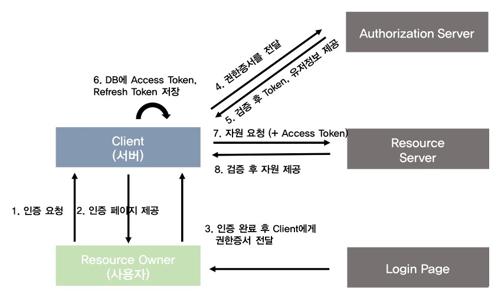
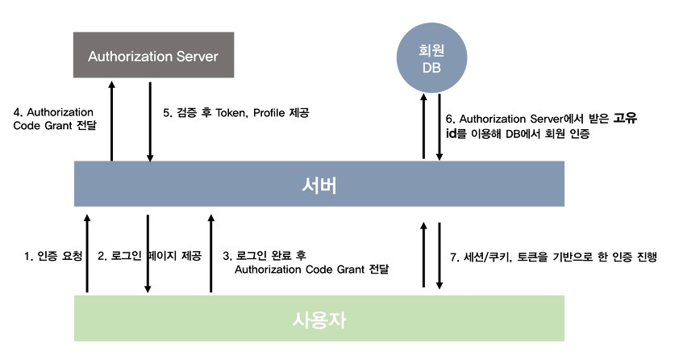

# Refresh Token, Access Token. OAUTH.

토큰 기반 인증 : 대표적으로 JWT, OAUTH

기본 JWT방식의 강화버전인 Aceess Token & Refresh Token

OAUTH2도 Access Token과 Refresh Token이 있다.

## 1. JWT(JSON Web Token)

### 1. JWT란?
- JWT(JSON Web Token)란 `JSON 포맷을 이용하여 사용자에 대한 속성을 저장하는 Claim 기반의 Web Token이다.`
- JWT는 토큰 자체를 **정보로 사용**하는 `자가 수용적(Self-Contained)방식`으로 정보를 안전하게 전달한다.
- 주로 `회원 인증`과 `정보 교류`를 하는 상황에서 사용된다.

- http 프로토콜은 상태(state)를 유지하지 **않는다.** 이를 stateless protocol이라 한다.
- `JWT기반 인증(토큰 기반 인증)은 상태를 서버에 유지하지 않는다.` <-> stateful서버
- HTTP 프로토콜은 요청(request)를 전송하고 응담(response)를 전송받는 시점에서 통신이 *종료*되며 어떠한 상태 정보도 남지 않는다. === 즉, 특정 클라이언트에서 동일 서버에 반복으로 접속해도 각각의 접속은 독립적인 트랜잭션(transaction)으로 취급된다.
- 따라서 로그인 화면에서 아이디, 패스워드를 입력하여 사용자 인증 과정을 거친 이후에 재차 웹사이트에 접근하면, 로그인 상태임을 인식(유지)할 수 없으므로 매번 사용자 인증 과정을 반복해야하는 문제가 발생한다.
- http 프로토콜의 상태 비유지(stateless)문제를 보완하여 클라이언와 서버 간의 논리적 연결을 위한 방법에는 Sesstion과 Cookie, 그리고 Cookie-Based Session 방식과 같은 stateful서버( <-> JWT기반 인증)가 있다.

### 2. JWT구조
-  jwt.io 사이트에서 암호화된 토큰화면 캡쳐</img>
  - 토큰을 만들기 위해서는 **Header, Payload, Verify Signature 세 가지**가 필요하다. JSON형태인 각 부분은 Base64로 인코딩 되어 표현한다. 각각의 부분을 이어주기 위해 **`.`** 구분자를 사용하여 구분한다. (Base64는 암호화된 문자열이 아니고, 같은 문자열에 대해 항상 같은 인코딩 문자열을 반환한다.)
    - `Header`: 위 세가지 정보를 암호화할 방식(alg)과 타입(typ)이 들어간다.
      - **alg**: 알고리즘 방식을 지정하며, 서명(Signature) 및 토큰 검증에 사용 ex)HS256(SHA256) 또는 RSA
      - **typ**: 토큰의 타입을 지정 ex)JWT
    - `Payload`: 토큰에서 사용할 정보의 조각들(속성 정보들)인 **클레임(Claim)**이 담겨있다. 총 세 가지의 클레임으로 나누어지며, JSON(Key/Value)형태로 다수의 정보를 넣을 수 있다.
      - 등록된 클레임(Registered Claim): 토큰 정보를 표현하기 위해 이미 정해진 종류의 데이터들로, 선택적으로 작성이 가능하며 사용할 것을 권장한다.(iss,sub,aud,exp,nbf,iat,jti)
      - 공개 클레임(Public Claim): 사용자 정의 클레임으로, 공개용 정보를 위해 사용된다. 충돌 방지를 위해 URI포맷을 이용한다.
      - 비공개 클레임(Private Claim): 사용자 정의 클레임으로, 서버와 클라이언트 사이에 임의로 지정한 정보를 저장한다.
    - `Verify Signature`: Header와 Payload를 각각 Base64로 인코딩하고, 인코딩 한 값을 SECRET KEY를 더해서 서명(Signature)된다. SECRET KEY를 알지 못하면 복호화할 수 없다. 안전하다.

### 3. JWT 동작
-  JWT기반 인증 방식 구현</img>
-  JWT 인증 동작</img>
    1. 클라이언트(사용자)가 로그인한다.
    1. 서버에서 계정정보를 읽어 사용자를 확인한 후, 사용자의 고유한 ID값을 부여한 후, 기타 정보와 함께 Payload에 넣는다.
    1. 서버는 요청을 확인하고 SECRET KEY를 통해 ACCESS TOKEN(JWT)을 발급한다. 유효기간도 설정.
    1. ACCEESS TOKEN(JWT)를 클라이언트에 전달한다.
    1. 클라이언트는 ACCESS TOKEN을 받아 저장한 후, 인증이 필요한 요청마다 토큰을 헤더에 실어서 보낸다. === 클라이언트가 Authorization header에 담긴 Access Token을 보낸다(OAUTH2.0사용). 또는 Cookie header에 저장된에 Access Token을 보낸다.
    1. 서버에서는 해당 토큰의 Vefity Signature를 SECRET KEY로 복호화한 후, 조작여부와 유효기간을 확인한다. 
    1. 검증이 완료되면 Payload를 디코딩하여 사용자정보를 확인해서 데이터를 가져온다.
- 토큰 기반 인증 사용의 `장점`
  - 상태 정보를 유지하지 않기 때문에 서버 확장성(Scalability)이 좋아지고 클라이언트는 쿠키를 전달할 필요가 없으므로 보안성이 강화되며 다른 서버(Facebook로그인, Google로그인 등)의 서비스에 정보를 공유할 수 있는 장점이 있다.
- `단점`
  - Self-contained는 양날의 검이 될 수 있다.
  - 이미 발급된 JWT에 대해 돌이킬 수 없다. 토큰을 임의로 삭제하는것이 불가능하므로 토큰 만료 시간(유효기간)을 꼭 넣어주어야한다. 세션/쿠키의 경우 악의적으로 이용이 되면 해당하는 세션을 지워버리면 된다. 하지만 JWT는 한 번 발급되면 유효기간이 완료될 때까지는 계속 사용이 가능해서 악의적인 사용자는 유효기간이 지나기 전까지 정보를 훔칠 수 있다.
    - 해결 = Access Token유효기간 짧게 + Refresh Token유효기간 길게.
  - Payload정보가 제한적이다. 따로 암호화되지 않기때문에 중간에 탈취해서 디코딩하면 누구나 정보를 확인할 수 있기때문에 유저의 중요한 정보들을 Payload에 넣을 수 없다. (세션/쿠키 방식은 유저의 정보가 전부 서버의 저장소에 안전하게 보관된다.)
  - JWT길이가 세션/쿠키 방식에 비해 길다. 따라서 인증이 필요한 요청이 많아질수록 서버의 자원낭비가 발생한다.
  - Tore Token: 토큰은 클라이언트 측에서 관리해야하기 때문에, 토큰을 저장해야한다.

## 2. Access Token
- 접속 토큰.
- 만료시간이 짧다. 1시간.
- 성공적으로 로그인 했음을 증명하는 암호문 형태의 증서이므로 외부에 노출되는 경우 치명적인 보안 이슈가 발생하게 된다. 따라서 탈취 되더라도 해커에 의해 남용될 수 있는 시간을 최소화하기 위해 유효 기간이 짧게 설정 되어 있다.

## 3. Refresh Token
- 접속 토큰
- 만료시간이 길다. 14일.
- Access Token의 유효 기간은 2시간이므로, 지속적으로 사용하려면 유효 기간이 만료되기 전에 재발급 해야한다. 때문에 인증 서버에서는 Access Token재발급 용도의 Refresh Token을 함께 제공한다.
- 특징
  - Access Token이 발급될 때 함께 제공된다.
  - Refresh Token을 사용하여 Access Token을 재발급 받을 수 있다.
  - Refresh Token의 유효기간은 14일 이다.
  - 한 번 사용된 Refresh Token은 폐기 된다.

## 4. Access Token과 Refresh Token
- Acess Token이 만료되었으나 Refrech Token이 만료되지 않은 경우, Access Token을 갱신하여 유효하게 할 수 있다.
-  Access Token + Refresh Token 인증 과정</img>
  1. 8번부터. 시간이 지나 Access Token이 만료되었다.
  1. 사용자는 이전과 동일하게 Access Token을 헤더에 실어 서버에 요청을 보낸다.
  1. 서버는 Access Token이 만료됨을 확인한다.
  1. 클라이언트에게 만료 신호로 권한 없음을 보낸다.
  1. 클라이언트는 Refresh Token과 Access Token을 함께 서버로 보낸다.
  1. 서버는 받은 Access Token이 조작되지 않았는지 확인한 후, Refresh Token과 사용자의 DB에 저장되어 있는 Refresh Token을 비교한다. Token이 동일하고, 유효기간도 지나지 않았다면 새로운 Access Token을 발급해준다.
  1. 서버는 새로운 Access Token을 헤더에 실어 다시 API요청을 진행한다.
- `장점`: 기존의 Access Token만 있을 때보다 안전하다.
- `단점`
  - FE,BE모두 검증 프로세스가 길어져서 구현하기 힘들어졌다.
  - Access Token이 만료될 때마다 새롭게 발급하는 과정에서 생기는 HTTP 요청 횟수가 많아졌다. 서버 자원 낭비로 귀결된다.
- Q: Access Token은 스스로 갱신을 못하는가?
  - A: stack overflow : 만약 Access Token이 노출되더라도 이 토큰은 유효기간이 짧기 때문에 해커는 이를 남용할 제한된 시간을 가지게 된다. 만약 Refresh Token이 노출되더라도 이는 쓸모가 없다. 왜냐하면 Access token을 얻기 위해 클라이언트는 id와 secret이 추가로 필요하기 때문이다.
  - 따라서 둘 다 사용하는 것이 보안상 안전하다.
- **`저장`**
  - Client Side 에서는 LocalStorage, Cookie
    - Access Token은 LocalStorage와 Cookie에 저장한다.
  - Server Side 에서는 Session, `Database`
    - DB에 실제 Refresh Token값을 저장하고 이때 index값을 Cookie나 LocalStorage에 저장하는 방법. 이 방법은 Refresh Token값은 노출시키지 않고, 큰 의미가 없는 index값만 노출되므로 보안상 좀 더 안전하게 저장할 수 있다. index보다 hash값을 생성해서 사용하면 보안에 더욱 유리하다.

---
<!-- OAUTH 정리중.... -->
## 5. OAuth2.0(Open Auth)(Authentication인증, Authorization인가=허가)
- </img>
- 인증 프로토콜이 아닌, 인가 프로토콜이다.
  - `외부 서비스`의 `인증 및 권한부여`를 관리하는 범용적인 `프로토콜`이다.
- JWT에서 배운 클라이언트와 서버간의 인증절차였던 세션/쿠키, 토큰 기반 인증 방식을 완전히 대체하는 것이 아니다. SNS로그인 기능을 넣더라도 결국은 세션/쿠키 방식이나 토큰을 활용해 인증을 거쳐야한다.
- 인증 방식 4가지.
    1. **Authorization Code Grant Type**(권한 코드 승인) - 많이 쓰이는 방식.
    1. Implicit Grant(암시적 승인)
    1. Resource Owner Password Credentials Grant(리소스 소유자 비밀번호 자격 증명)
    1. Client Credentials Grant Type(클라이언트 자격 증명)
- 용어설명
    - </img>
    - Resource Owner(리소스의 소유자): User, 즉 일반 사용자를 칭한다.
    - Authorization Server: 권한을 관리하는 서버. Access Token,Refresh Token을 발급, 재발급 해주는 역할.
    - Resource Server(리소스를 가지고 있는 서버): OAuth2.0을 관리하는 서버(Google,Facebook, Naver등)의 자원을 관리하는 서비스. OAuth2.0 관리서버의 자체 API를 의미한다. *우리가 만드는 서버의 자원을관리하는 곳이 아니다.*
    - Client(리소스가 필요한 사용자)
- 동작 순서
  - </img>
      1. Resource Owner(사용자)가 Client(우리 서버)에게 인증 요청을 한다.
      1. Client는 Authorization Request를 통해 Resource Owner에게 인증할 수단(ex Google, Facebook 로그인 url)을 보낸다.
      1. Resource Owner는 해당 Request를 통해 인증을 진행하고 인증을 완료했다는 신호로 권한증서(Authorization Grant)를 url에 실어 Client에게 보낸다.
      1. Client는 해당 권한증서를 Authorization Server에 보낸다.
      1. **Authorization Server는 권한증서를 확인 후, 유저가 맞다면 Client에게 Access Token, Refresh Token, 유저의 프로필 정보(id 포함)등을 발급해준다.**
      1. Client는 해당 Access Token을 DB에 저장하거나 사용자(Resource Owner)에게 넘긴다.
      1. 사용자가 Resource Server에 자원이 필요하면, Client는 Access Token을 담아 Resource Server에 요청한다.
      1. Resource Server는 Access Token이 유효한지 확인 후, Client에게 자원을 보낸다.
      1. 만일 Access Token이 만료되었거나 위조되었다면, Client는 Authorization Server에 Refresh Token을 보내 Access Token을 재발급 받는다.
      1. 그 후 다시 Resource Server에 자원을 요청한다.
      1. 만일 Refresh Token도 만료되었을 경우, Resource Owner는 새로운 Authorization Grant를 Client에게 넘겨야한다.(사용자가 다시 로그인하라는 뜻)
  - </img>
      1. 사용자(Resource Owner)가 서버에게 로그인을 요청한다.
      1. 서버는 사용자에게 특정 쿼리들을 붙인 페이스북 로그인 URL을 사용자에게 보낸다.
      1. 사용자는 해당 URL로 접근하여 로그인을 진행한 후 권한증서(code)를 담아 서버에게 보낸다.
      1. 서버는 해당 권한증서를 Facebook의 Authorization Server로 요청한다.
      1. 서버는 권한 증서를 확인 후, Access Token, Refresh Token, 유저의 정보(고유 id포함)등을 돌려준다.
      1. 받은 고유 id를 key값으로 해서 DB에 유저가 있다면 로그인, 없다면 회원가입을 진행한다.
      1. 로그인이 완료되었다면 세션/쿠키, 토큰기반 인증 방식을 통해 사용자의 인증을 처리한다.

---
- 참고
- JWT
  - (https://velopert.com/2389)
  - (https://mangkyu.tistory.com/56)
  - (http://www.opennaru.com/opennaru-blog/jwt-json-web-token/)
- refresh token, access token
  - (https://developers.cafe24.com/ko/app/front/develop/oauth/retoken)
  - (https://tansfil.tistory.com/58)
  - (https://tansfil.tistory.com/59)
- 저장위치
  - (https://velog.io/@ehdrms2034/Access-Token-%EC%A0%80%EC%9E%A5-%EC%9C%84%EC%B9%98%EC%97%90-%EB%8C%80%ED%95%9C-%EA%B3%A0%EC%B0%B0)
  - (https://doogle.link/jwt-%ED%98%B9%EC%9D%80-oauth2-%EC%9D%98-refresh-%ED%86%A0%ED%81%B0%EC%9D%84-%EC%96%B4%EB%94%94%EB%8B%A4-%EC%A0%80%EC%9E%A5%ED%95%B4%EC%95%BC-%ED%95%A0%EA%B9%8C/)
- oauth
  - (https://tansfil.tistory.com/60?category=475681)
  - (https://d2.naver.com/helloworld/24942)
  - (https://gdtbgl93.tistory.com/180)
  - (https://velog.io/@undefcat/OAuth-2.0-%EA%B0%84%EB%8B%A8%EC%A0%95%EB%A6%AC)